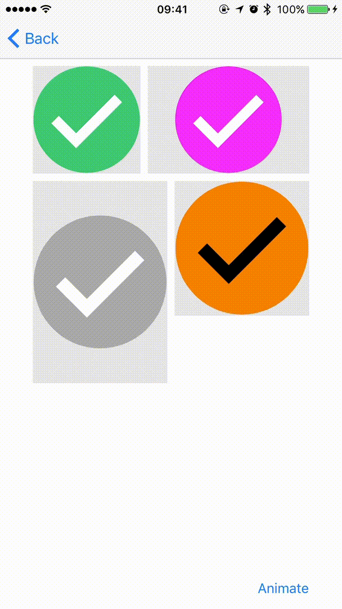
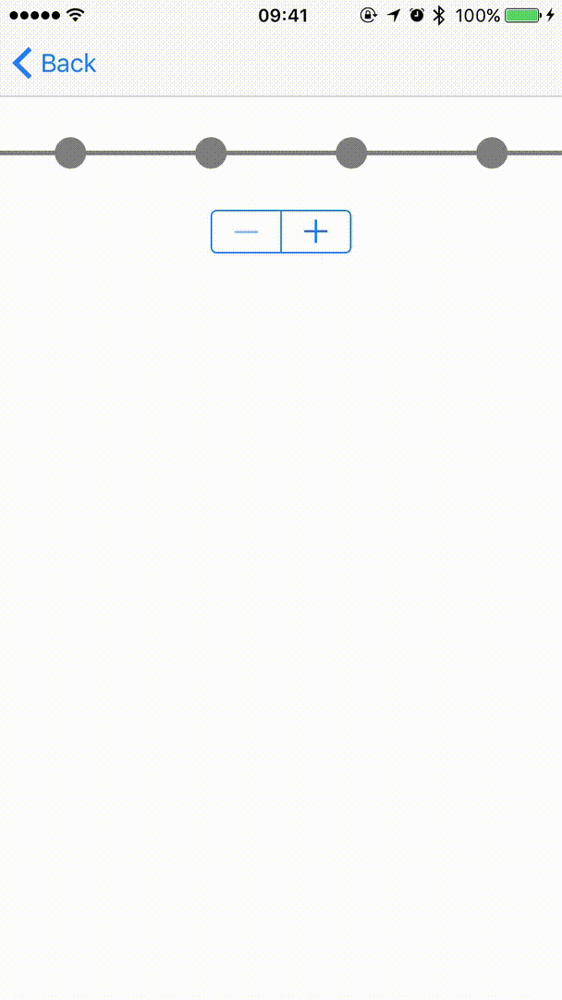

# DM3Collection
Collection of UI elements 

## Installation
### CocoaPods
The recommended way for installating `DM3Collection` is via the [CocoaPods](http://cocoapods.org/) package manager
``` ruby
pod 'DM3Collection'
```

## Submodules
###  DM3CheckmarkView
<p align="center">
  
</p>

### Properties

Specify circle color:
``` objectivec
@property (nonatomic, strong) UIColor *circleColor;
```

Specify checkmark itself color:
``` objectivec
@property (nonatomic, strong) UIColor *checkmarkColor;
```

Specify animation duration:
``` objectivec
@property (nonatomic) double animationDuration;
```

Use the following method to trigger animation:
``` objectivec
- (void)animateCheckmark;
```

###  DM3BreadcrumbsView
<p align="center">
  
</p>

``` objectivec
@property (nonatomic, strong) UIColor *leftLineColor;
```

``` objectivec
@property (nonatomic, strong) UIColor *rightLineColor;
```

``` objectivec
@property (nonatomic, strong) UIColor *circleColor;
```

``` objectivec
@property (nonatomic) CGFloat lineHeight;
```

``` objectivec
@property (nonatomic) CGFloat circleDiametr;
```

``` objectivec
@property (nonatomic) BOOL circleShouldGlow;
```

